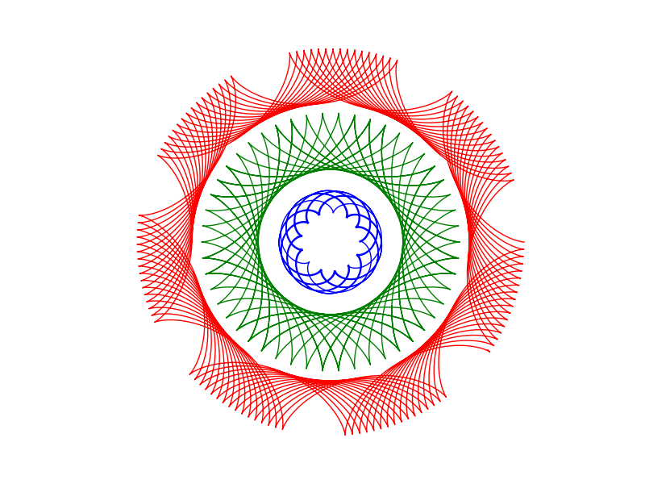

# Spirograph pictures
More doing math with python.

Spirograph was an awesome device which allows people to draw pretty pictures with various discs. They have a lovely quality of mixing symmetry with intricacy.

This repo was made to understand the underlying geometry and number theory of these pictures. I've started by using python due to its clarity and flexibility. For example, it is easy to produce images like this.

I have started implementing the curves in the spirodraw/spirograph_functions.py. These shouldbe chiefly forms of hypocycloids and epicycloids, though other curves may be implemented.

I've started with drawing them using matplotlib as this is easy to do and works well in the jupyter notebook.

See [spirograph.ipynb](spirograph.ipynb) for a basic demonstration of the code.